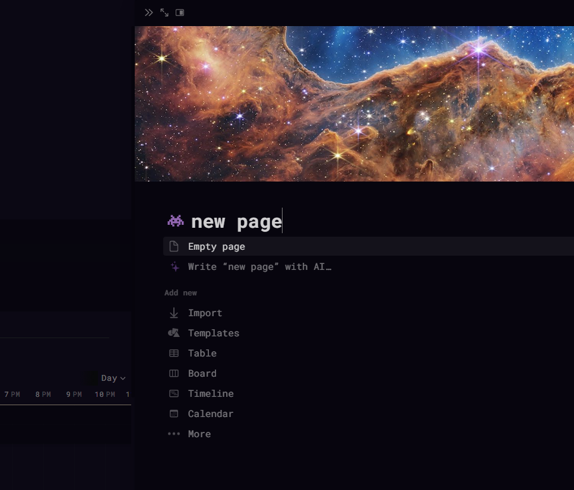
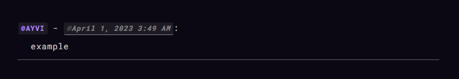
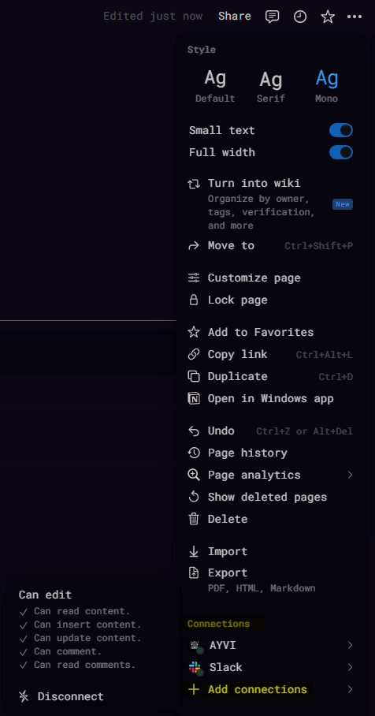

# notion-api

<p align="center">
    <a href="https://pypi.org/project/notion-api"></a>
    &nbsp;
    <a href="https://pypi.org/project/notion-api"></a>
    &nbsp;
    </a>
    &nbsp;
    </a>
    &nbsp;
    <a href="https://developers.notion.com/reference/versioning"></a>
    &nbsp;
</p>
<p align="center">
    <a href="https://github.com/ayvi-0001/notion-api/blob/main/LICENSE"></a>
    &nbsp;
    <a href="https://github.com/psf/black"></a>
    &nbsp;
    <a href="https://pycqa.github.io/isort/"></a>

</p>

__Disclaimer: This is an _unofficial_ package and has no affiliation with Notion.so__  

A wrapper for Notion's API, aiming to simplify the dynamic nature of interacting with Notion. This project is still a work in progress, and features will continue to change. Below are a few examples of the current functionality. 

<br>

<div border="0" align="center">
    <table>
        <tr>
            <td align="center"><b>Links: Notion API Updates</b></td>
        </tr>
            <td> <a href="https://developers.notion.com/reference/intro">API Reference</a></td><tr>
        </td>
            <td><a href="https://developers.notion.com/page/changelog">Notion API Changelog </img></a></tr>
            <td> <a href="https://www.notion.so/releases">Notion.so Releases</a></td></tr>
            <td> <a href="https://developers.notion.com/page/notion-platform-roadmap">Notion Platform Roadmap</a></td>
        </tr>
    </table>
</div>

---

## Install
```
pip install -U notion-api
```

## Usage
```py
import dotenv

import notion

# client will check env variables for 'NOTION_TOKEN'
dotenv.load_dotenv()  

homepage = notion.Page('773b08ff38b44521b44b115827e850f2')
parent_db = notion.Database(homepage.parent_id)

# will also look for env var `TZ` to set the timezone for all notion objects. If not found, will default to local timezone.
```

`__getitem__` searchs for page property values when indexing a Page, and for property objects when indexing a Database.

```py
homepage['dependencies']
# {
#     "id": "WYYq",
#     "type": "relation",
#     "relation": [
#         {
#             "id": "7bcbc8e6-e237-434b-bd0d-6b56e044200b"
#         }
#     ],
#     "has_more": false
# }

parent_db['dependencies']
# {
#     "id": "WYYq",
#     "name": "dependencies",
#     "type": "relation",
#     "relation": {
#         "database_id": "f5984a7e-2257-4ab0-9d0a-23ea12324031",
#         "type": "dual_property",
#         "dual_property": {
#             "synced_property_name": "blocked",
#             "synced_property_id": "wx%7DQ"
#         }
#     }
# }
```

**_See usage of retrieving values from a page in examples/retrieving-property-items.md_**  

Below is a brief example if we were wanting to get the page id from the above property `dependencies` in `homepage`.

```py
from notion import propertyitems

related_id: list[str] = propertyitems.relation(homepage.dependencies)
```
```py
>>> ["7bcbc8e6-e237-434b-bd0d-6b56e044200b"]
```

Both Page's and Database's have setters for title/icon/cover.

```py
homepage.title = "new page"
homepage.cover = "https://www.notion.so/images/page-cover/webb1.jpg"
homepage.icon = "https://www.notion.so/icons/alien-pixel_purple.svg"
```

<p align="center">  </p>

<br>

## Creating Pages/Databases/Blocks

The current version of the Notion api does not allow pages to be created to the parent `workspace`.  
Create objects by passing an existing Page/Database instance as an arg to the `create` classmethods.

```py
new_database = notion.Database.create(
    parent_instance=testpage,
    database_title="Title",
    name_column="page", # This is the column containing page names. Defaults to "Name".
    is_inline=True,
    description="Example Database.",
)

new_page = notion.Page.create(new_database, page_title="A new database row")
```

Blocks can be created with `notion.api.blocktypefactory.BlockFactory` by appending to an exisiting Block or Page.  
The new block is always returned as an instance of `notion.api.notionblock.Block`.
```py
from notion import properties as prop

# `new_synced_block` refers to the original synced block in the Notion UI.
original_synced_block = notion.BlockFactory.new_synced_block(homepage)

# Adding content to the synced block
notion.BlockFactory.paragraph(
    original_synced_block, [prop.RichText("This is a synced block.")]
)
# Referencing the synced block in a new page.
notion.BlockFactory.reference_synced_block(new_page, original_synced_block.id)
```

<br>

### Example Workflow: **_Appending blocks to a page as a reminder._**

```py
def in_block_reminder(page: notion.Page, message: str, user_name: str) -> None:
    mentionblock = notion.BlockFactory.paragraph(
        page,
        [
            prop.Mention.user(
                notion.Workspace().retrieve_user(user_name=user_name),
                annotations=prop.Annotations(
                    code=True, bold=True, color=prop.BlockColor.purple
                ),
            ),
            prop.RichText(" - "),
            prop.Mention.date(
                datetime.now().astimezone(target_page.tz).isoformat(),
                annotations=prop.Annotations(
                    code=True, bold=True, color=prop.BlockColor.purple_background
                ),
            ),
            prop.RichText(":"),
        ],
    )
    # First method returned the newly created block that we append to here:
    notion.BlockFactory.paragraph(mentionblock, [prop.RichText(message)])
    notion.BlockFactory.divider(page)
```

```py
>>> my_page = notion.Page("0b9eccfa890e4c3390175ee10c664a35")
>>> in_block_reminder(page=my_page, message="message here", user_name="Your Name")
```
<p align="center">
    
</p>

<br>

## Add, Set, & Delete: Page property values | Database property objects

The first argument for all database column methods is the name of the property,  
If it does not exist, then a new property object is created.  
If it already exists, then the method will overwrite it.

If the name passed already exists, but it's a different column type than the method used - then the API will overwrite this and change the property object to the new column type.  
The original parameters will be saved if you decide to switch back (i.e. if you change a formula column to a select column, upon changing it back to a formula column, the original formula expression will still be there).   

```py
new_database.formula_column("page id", expression="id()")

new_database.delete_property("url")

new_database.multiselect_column(
    "new options column",
    options=[
        prop.Option("option-a", prop.PropertyColor.red),
        prop.Option("option-b", prop.PropertyColor.green),
        prop.Option("option-c", prop.PropertyColor.blue),
    ],
)

# if an option does not already exist, a new one will be created with a random color.
# this is not true for `status` column types, which can only be edited via UI.

new_page.set_multiselect("options", ["option-a", "option-b"])
```

<br>

## Database Queries

A single `notion.query.propfilter.PropertyFilter` is equivalent to filtering one property type in Notion.
To build filters equivalent to Notion's 'advanced filters', use `notion.query.compound.CompoundFilter`.

```py
from datetime import datetime
from datetime import timedelta

from notion import query

TODAY = datetime.combine(datetime.today(), datetime.min.time())
TOMORROW = TODAY + timedelta(1)

query_filter = query.CompoundFilter()._and(
    query.PropertyFilter.date("date", "created_time", "on_or_after", TODAY.isoformat()),
    query.PropertyFilter.date("date", "created_time", "before", TOMORROW.isoformat()),
    query.CompoundFilter()._or(
        query.PropertyFilter.text("name", "title", "contains", "your page title"),
        query.PropertyFilter.text("name", "title", "contains", "your other page title"),
    ),
)

query_sort = query.SortFilter(
    [
        query.PropertyValueSort.ascending("your property name"),
        query.EntryTimestampSort.created_time_descending(),
    ]
)

query_result = new_database.query(
    filter=query_filter,
    sort=query_sort,
    page_size=5,
    filter_property_values=["name", "options"],
)
```

A database also has the `query_pages()` method. It takes the same parameters, but for each page object in the `results` array, it retrieves the id(s), and instead returns a list of `notion.Page`.

<br>

## Exceptions & Validating Responses

Errors in Notion requests return an object with the keys: 'object', 'status', 'code', and 'message'.
Exceptions are raised by matching the error code and returning the message. For example:

```py
homepage._patch_properties(payload={'an_incorrect_key':'value'})
# Example error object for line above..
# {
#   'object': 'error', 
#   'status': 400, 
#   'code': 'validation_error', 
#   'message': 'body failed validation: body.an_incorrect_key should be not present, instead was `"value"`.'
# }
```

```sh
Traceback (most recent call last):
File "c:\path\to\file\_.py", line 6, in <module>
    homepage._patch_properties(payload={'an_incorrect_key':'value'})
File "c:\...\notion\exceptions\validate.py", line 48, in validate_response
    raise NotionValidationError(message)
notion.exceptions.errors.NotionValidationError: body failed validation: body.an_incorrect_key should be not present, instead was `"value"`.
Error 400: The request body does not match the schema for the expected parameters.
```

Possible errors are:
 - `NotionInvalidJson`
 - `NotionInvalidRequestUrl`
 - `NotionInvalidRequest`
 - `NotionValidationError`
 - `NotionMissingVersion`
 - `NotionUnauthorized`
 - `NotionRestrictedResource`
 - `NotionObjectNotFound`
 - `NotionConflictError`
 - `NotionRateLimited`
 - `NotionInternalServerError`
 - `NotionServiceUnavailable`
 - `NotionDatabaseConnectionUnavailable`

A common error to look out for is `NotionObjectNotFound`. This error is often raised because your bot has not been added as a connection to the page. 

<p align="center">
      
</p>

By default, a bot will have access to the children of any Parent object it has access too. Be sure to double check this connection when moving pages.  
If you're working on a page that your token has access to via its parent page/database, but you never explicitly granted access to the child page -  and you later move that child page out, then it will lose access.

---
