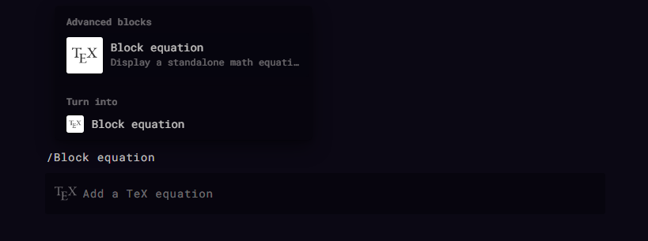
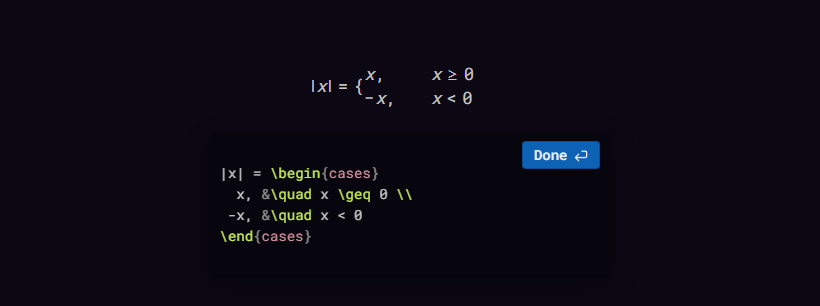
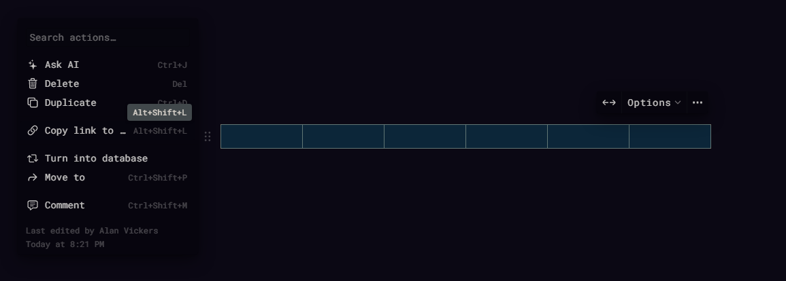
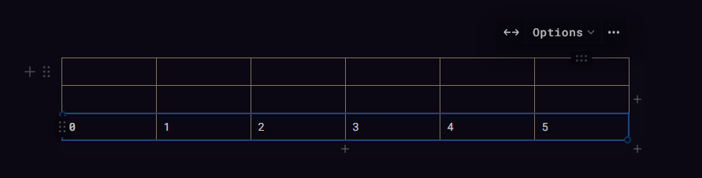
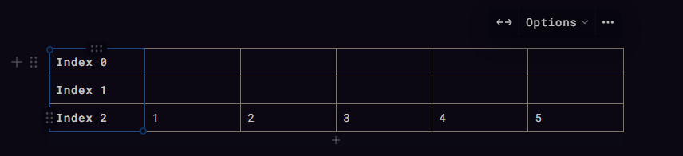
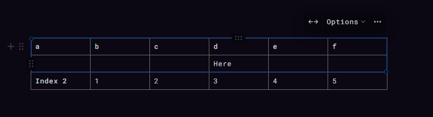
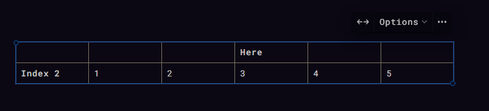
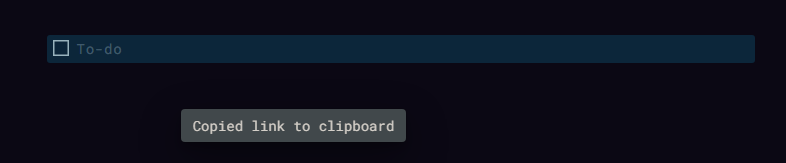
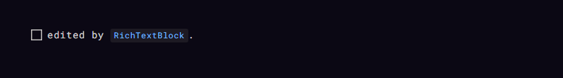

```py
import notion
```

## `EquationBlock`

<p align="center"></p>

```py
example_block = notion.EquationBlock("4dcbfce3aa1f4beb9b685cf729994dda")

expression = r"""
|x| = \begin{cases}
  x, &\quad x \geq 0 \\
 -x, &\quad x < 0
\end{cases}
"""

example_block.expression = expression
```

<p align="center"></p>

---

## `TableBlock`

To retrieve the block id of a table, highlight the entire table, type `Alt` + `Shift` + `L`, to copy to clipboard.

<p align="center"></p>

or, create a new table:

```py
parent: notion.Page | notion.Block

table = notion.Block.table(
    parent, 
    table_width=6, # default = 2
    has_column_header=False, # default
    has_row_header=False # default
)
```

Note that the table_width cannot be changed via the API after you create/instatiate a table.  
All cell values are strings, since the underlying object in Notion is `rich_text`.

```py
# if no values are given, a blank row will be created.
table.append_row()

# pass a list of strings to insert values
table.append_row(["0", "1", "2", "3", "4", "5"])
```

<p align="center"></p>

The list of values must match the table width, or `NotionValidationError` will raise:

```py
table.append_row(["0", "1", "2", "3", "4"])
```

```sh
Traceback (most recent call last):
  File "C:\path_to_file\...\main.py", line 246, in <module>
    table.append_row(["0", "1", "2", "3", "4"])
  File "C:\path_to_file\...\notion\api\block_ext\table.py", line 113, in append_row
    self._patch(
  File "C:\path_to_file\...\notion\api\client.py", line 180, in _patch
    validate_response(response)
  File "C:\path_to_file\...\notion\exceptions\validate.py", line 74, in validate_response
    raise NotionValidationError(message)
notion.exceptions.errors.NotionValidationError: Content creation Failed. Fix the following:
Number of cells in table row must match the table width of the parent table
Error 400: The request body does not match the schema for the expected parameters.
```

`TableBlock` methods have a 0 index. Use a point with (`row_index`, `column_index`) to get/edit cell values.

```py
table.edit_cell(0, 0, value="Index 0")
table.edit_cell(1, 0, value="Index 1")
table.edit_cell(2, 0, value="Index 2")
```

<p align="center"></p>


or overwrite an entire row.

```py
table.overwrite_row(0, ["a", "b", "c", "d", "e", "f"])
table.overwrite_row(1, ["", "", "", "Here", "", ""])
```

<p align="center"></p>

```py
print(table.get_cell(1, 3))
```
```py
>>> Here
```

`get_row(...)` will return a list containing each value, with an empty string if a cell has no value.  
`get_table(...)` will return a list containing each row.  

```py
print(table.get_row(0))
print(table.get_table())
```

```py
>>> ['a', 'b', 'c', 'd', 'e', 'f']

>>> [['a', 'b', 'c', 'd', 'e', 'f'], 
     ['', '', '', 'Here', '', ''], 
     ['Index 2', '1', '2', '3', '4', '5']]
```

Clear a cell's content by editing it and passing an empty string, or use `delete_row(...)` to remove the entire row.

```py
table.delete_row(0)
```

<p align="center"></p>

---

## `RichTextBlock`

`RichTextBlock` can be used on any block that has a `rich_text` key that can be edited.  
Trying to create a `RichTextBlock` with a block id that doesn't satisfy this requirement will raise a `TypeError`, and show the list of available block types.

```sh
...
    raise TypeError(f"Block type must be one of {TEXT_EDITABLE_BLOCKS}.")
TypeError: Block type must be one of ['paragraph', 'to_do', 'heading_1', 'heading_2', 'heading_3', 'bulleted_list_item', 'numbered_list_item', 'toggle', 'quote', 'callout'].
```

This block doesn't use a setter, but uses the method `set_text(...)` with a list of `notion.properties.RichText` objects instead.  
This is so the text can be segmented, allowing for annotations on specific words.  
Example:

<p align="center"></p>


```py
textblock = notion.RichTextBlock("fffb528fd1604bc08386310ee8de0300")
textblock.set_text(
    [
        prop.RichText("edited by "),
        prop.RichText(
            "RichTextBlock", annotations=prop.Annotations(code=True, color="blue")
        ),
        prop.RichText("."),
    ]
)
```

<p align="center"></p>


## `ToDoBlock`

This block inherits from `notion.RichTextBlock`, so we could have done the above with just the `ToDoBlock`.

`ToDoBlock`'s simply add the setter `checked`.

```py
todoblock = notion.ToDoBlock(textblock.id)
todoblock.checked = True
```


<p align="center"></p>

---
